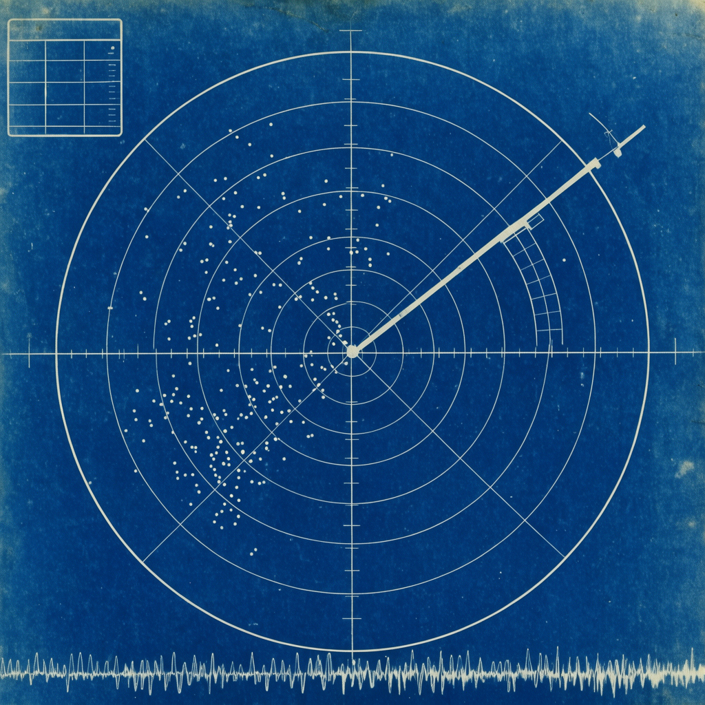

# Hermes Monitoring Dashboard



A Hermes plugin with a Python hardware sampler and a desktop monitoring page. The sidebar opens
**Monitoring**; a statusbar chip shows estimated tok/s and temperature.

- CPU clusters/cores, GPU activity and clocks, thermal and power readings.
- Memory, swap, storage, disk and network I/O.
- Live sessions, subagents, gateway events and token throughput.

Hardware data comes from this package's `/api/plugins/hermes-monitoring-dashboard/metrics` endpoint,
not a core `system.metrics` RPC. Unreadable readings stay null. **SIM** is a labelled synthetic fleet
for demos; it never supplies hardware readings.

## Requirements

Use a Hermes version supporting unified Python + desktop plugins and the desktop SDK's `ctx.rest`.
No custom Hermes branch or rebuilt desktop bundle is needed for the metrics backend.

The Python side uses `psutil` and FastAPI from the Hermes backend environment. Apple Silicon sensors
use IOReport/HID through ctypes, without sudo. NVIDIA sensors use the installed driver's NVML library.
Machines without those sensors still expose the available psutil readings.

The readings describe the **backend host**. For remote connections, install/enable the Python half
on that host and the desktop half on the client. Installing only the UI does not add remote sensors.

## Install

Once this version is published, install both components from the repository through Hermes's
**Install from Git** dialog, or install the backend package with:

```sh
hermes plugins install austinpickett/hermes-monitoring-dashboard --enable
```

Enable the desktop half in **Capabilities → Plugins** as well. Restart the backend after installing
its Python API, and rescan desktop plugins. The two enable choices are separate.

### Existing desktop-only installation

The old installation symlinked `plugin/` into `desktop-plugins/hermes-monitoring-dashboard`.
This version is a unified package: `plugin.yaml`, `dashboard/`, `desktop/` and `skills/` at the repo root.
Move the old standalone desktop folder/symlink aside before rescanning. Hermes deliberately does not
overwrite a marker-less standalone plugin with a package-managed copy. Keep your existing build
assets; they are not part of the plugin installation.

The composition skill ships at `skills/compose-monitoring-dashboard` and is explicitly registered
as `hermes-monitoring-dashboard:compose-monitoring-dashboard`. Native plugin skills are available
through `skills_list`/`skill_view`, but are not automatically included in the model's startup skill
index. For natural-language discovery ("create a blank dashboard"), add the installed package's
`skills` directory to `skills.external_dirs`, preserving existing entries, then start a new chat.
For a default installation that path is `~/.hermes/plugins/hermes-monitoring-dashboard/skills`.
Replace any obsolete entry pointing into the old desktop-only package with this path.

## Configurable widgets

User configuration lives in `~/monitoring-dashboard/dashboard.json`, **outside the plugin
installation**, on the desktop device. See [`examples/dashboard.json`](examples/dashboard.json)
and the [composition skill](skills/compose-monitoring-dashboard/SKILL.md) for the version 1 schema
and safe prompt-driven edits. A config alone reveals Monitoring; it is polled every two seconds.
Titles, accents, plain text/emoji, local clock/date, backend-host uptime, month calendar, existing
monitoring panels, widths and order are configurable in one dashboard. No custom JavaScript runs.

A valid config takes precedence over legacy `page.html` / `panel-*.html` markers. Removing it
returns to those markers. Invalid JSON/schema retains the last valid config **in memory for this
plugin session**, with an error banner; on restart an invalid file falls back to marker mode until
repaired. Unknown widget types get an unsupported card, not code execution. Demo Reset is disabled
for configured/error states. The dashboard reads config but never rewrites user data.

Local clock/calendar belong to the desktop's timezone; uptime and hardware describe the backend
host, which may be remote. The calendar has no synthetic events or connected accounts. Edits are
currently through JSON or Hermes prompts, not an in-card form editor.

## Develop

Work in a separate checkout/worktree. Stage into an **explicit development home**, not your live home:

```sh
HERMES_HOME=/absolute/path/to/dev-home node scripts/sync-plugin.mjs
HERMES_HOME=/absolute/path/to/dev-home hermes plugins enable hermes-monitoring-dashboard
```

The sync script copies both halves, refuses to overwrite installs owned elsewhere, and does not
change configuration or touch a legacy standalone desktop installation. Restart that home's backend
and rescan desktop plugins after staging Python changes.

The browser harness renders `desktop/plugin.js` with the plugin's own backend sampler, without
Electron or the core metrics branch. Use Python with FastAPI, uvicorn and psutil installed (a Hermes
test environment works):

```sh
HERMES_AGENT_DIR=/path/to/hermes-agent scripts/build-vendor.sh
python harness/server.py
open "http://127.0.0.1:5188/harness/"
```

`HERMES_AGENT_DIR` is only needed to borrow React/esbuild for the browser harness. The installed
plugin uses the desktop app's React. `?sim` enables the labelled synthetic fleet.

Preview configured widgets with `/harness/?widgets`, an empty config with `?widgets=empty`,
and an invalid config with `?widgets=invalid`. The default URL still exercises legacy markers.
These are explicit UI fixtures; hardware remains real unless `?fixture=...` is requested.
`window.harness.setConfig(objectOrText)` changes the in-memory file seam for live polling checks;
`setConfig(null)` restores marker mode. No live user config is touched.
Focused checks: `node --test tests/ui/widgets.mjs tests/ui/metrics.mjs`.

`scripts/cdp.mjs` takes screenshots or evaluates JS over CDP:
`CDP_PORT=9333 node scripts/cdp.mjs shot out.png`, or `node scripts/cdp.mjs eval "<js>"`.

## Safety and limits

The sampler shares one cached window across pollers, owns CPU counter snapshots across threads,
and degrades unavailable sections independently. Native sample pointers are checked before use;
reset/shutdown releases owned sensor resources. This is not a process sandbox: native bindings run
inside the Python backend. Apple private APIs may change with macOS releases.

Apple Silicon live reads and fault/cleanup probes are exercised on a physical Mac. NVIDIA ABI and
multi-die channel fixtures cover compatibility logic; they do not substitute for physical NVIDIA
or Ultra hardware verification.
